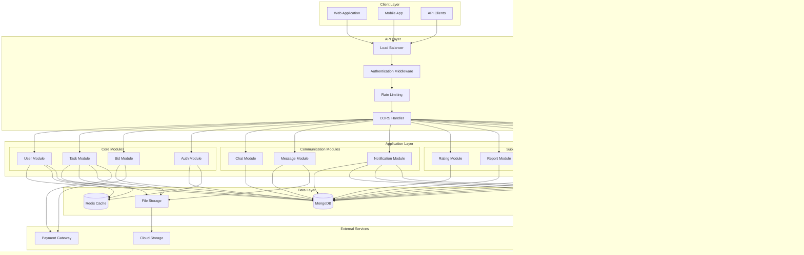

# Task Titans - System Architecture Documentation

## Overview

Task Titans is a comprehensive task management and freelancing platform built with Node.js, Express, and MongoDB. This document provides architectural diagrams and system flow documentation to help understand the application structure and interactions.

## System Architecture Diagram

## Module Interaction Diagram

## Task Management Flow Sequence Diagram

## Bidding Process Sequence Diagram

## Chat and Messaging Flow

## Authentication and Authorization Flow

## Rating and Review System Flow

## File Upload and Management Flow

## Error Handling and Logging Flow

## Data Models Relationship Diagram

## Security Architecture

## Deployment Architecture

## Performance Optimization Strategy

## Conclusion

This architectural documentation provides a comprehensive overview of the Task Titans system, including:

- **System Architecture**: High-level view of all components and their interactions
- **Module Interactions**: How different modules communicate with each other
- **Sequence Diagrams**: Detailed flow of major business processes
- **Data Models**: Database schema and relationships
- **Security Architecture**: Multi-layered security approach
- **Deployment Strategy**: Production environment setup
- **Performance Optimization**: Strategies for optimal performance

These diagrams and documentation serve as a reference for developers, architects, and stakeholders to understand the system's design, flow, and implementation details.