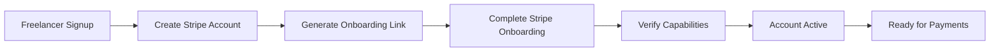
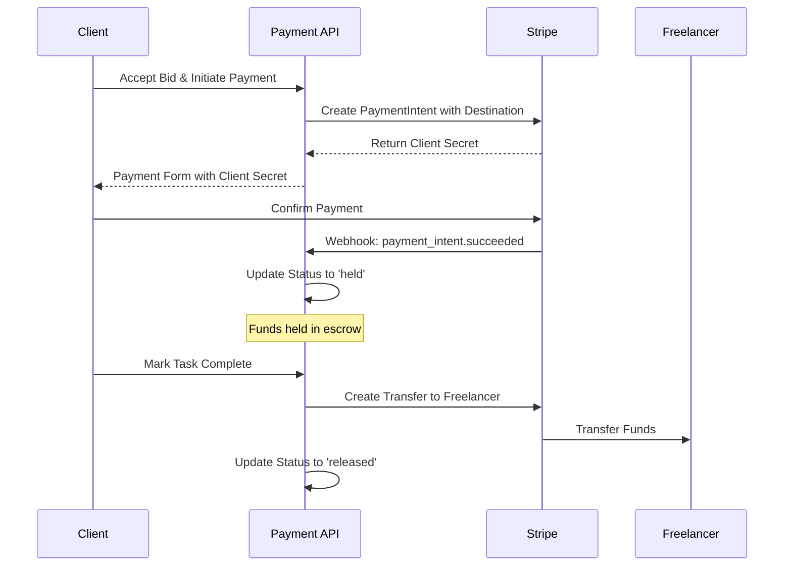
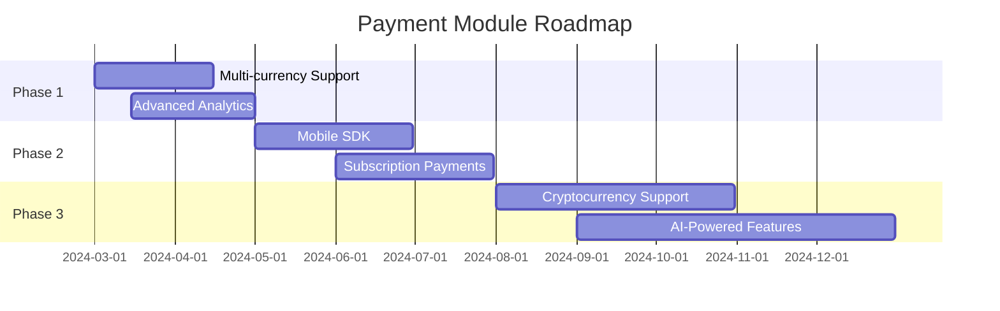

# Task Titans Payment Module

## Overview

The Payment Module is a comprehensive **Stripe Connect-based escrow system** built with **Mongoose ODM** and **MongoDB** for the Task Titans platform. This module ensures secure, transparent, and efficient payment processing between clients and freelancers while automatically collecting platform fees.

### 🚀 Key Highlights
- **Modern Architecture**: Built with Mongoose ODM, TypeScript, and Express.js
- **Stripe Connect Integration**: Multi-party payments with automatic fee distribution
- **Secure Escrow System**: Funds held safely until task completion
- **Real-time Processing**: Webhook-driven status updates
- **Enhanced Type Safety**: Comprehensive TypeScript interfaces and enums
- **Consistent Architecture**: Aligned with project patterns (User, Task, Bid modules)
- **Bid Integration**: Full integration with bid system for payment tracking
- **Standardized Responses**: Consistent API responses using sendResponse utility
- **Production Ready**: Comprehensive error handling, validation, and monitoring

## 🏗️ Architecture Overview

```
┌─────────────────┐    ┌─────────────────┐    ┌─────────────────┐
│   Frontend      │    │  Payment API    │    │   Stripe API    │
│                 │    │                 │    │                 │
│ • Payment Forms │◄──►│ • Controllers   │◄──►│ • Connect       │
│ • Status Checks │    │ • Services      │    │ • PaymentIntents│
│ • History Views │    │ • Webhooks      │    │ • Transfers     │
└─────────────────┘    └─────────────────┘    └─────────────────┘
                              │
                              ▼
                       ┌─────────────────┐
                       │   MongoDB       │
                       │                 │
                       │ • Payments      │
                       │ • StripeAccounts│
                       │ • Users & Tasks │
                       └─────────────────┘
```

## ✨ Core Features

### Payment Processing
- **Stripe Connect Integration**: Seamless multi-party payment processing
- **Escrow System**: Secure fund holding with automatic release mechanisms
- **Fee Management**: Configurable platform fee collection (default 20%)
- **Payment Intents**: Modern Stripe Payment Intents API integration
- **Multi-currency Support**: Extensible currency support (USD primary)
- **Enhanced Status Management**: Comprehensive payment status tracking (PENDING, HELD, RELEASED, REFUNDED, FAILED, CANCELLED)
- **Business Type Support**: Individual and company account types
- **Bid Tracking**: Direct relationship with bid system for complete payment lifecycle
- **Model Integration**: Enhanced payment model with bidId field for better data relationships

### Account Management
- **Express Accounts**: Streamlined freelancer onboarding via Stripe Express
- **Onboarding Links**: Dynamic account setup link generation
- **Status Tracking**: Real-time onboarding and capability monitoring
- **Compliance**: Automated KYC/AML through Stripe's verification system

### Transaction Management
- **Escrow Payments**: Secure payment holding until task completion
- **Automatic Transfers**: Seamless fund transfer to freelancers upon release
- **Refund Processing**: Comprehensive refund handling for various scenarios
- **Payment History**: Complete transaction tracking and reporting

## 🔒 Security Features

- **PCI DSS Compliance**: Stripe handles all sensitive payment data
- **Webhook Verification**: Cryptographic verification of all Stripe webhooks
- **Input Validation**: Comprehensive Joi-based validation schemas
- **Rate Limiting**: Express-rate-limit protection against abuse
- **Authentication**: JWT-based API authentication
- **Audit Logging**: Complete audit trail of all payment operations
- **Error Handling**: Secure error responses without data leakage

## 🔄 Payment Flow

### 1. Freelancer Onboarding Flow


### 2. Escrow Payment Process


### 3. Fee Distribution Model
```
💰 Total Payment: $100.00
├── 🏢 Platform Fee (20%): $20.00
└── 👨‍💻 Freelancer Amount (80%): $80.00

Automatic Collection:
✓ Platform fee collected during payment processing
✓ Freelancer receives net amount via Stripe Transfer
✓ No manual fee deduction required
```

## 📡 API Endpoints

### Authentication & Authorization

All payment endpoints require JWT authentication and role-based authorization using the `USER_ROLES` enum:

```typescript
// User Roles (from src/enums/user.ts)
export enum USER_ROLES {
  SUPER_ADMIN = 'SUPER_ADMIN',  // Full system access
  POSTER = 'POSTER',            // Task creators/clients
  TASKER = 'TASKER',            // Freelancers/service providers
}
```

**Role Permissions:**
- **SUPER_ADMIN**: Full access to all payment operations and statistics
- **POSTER**: Can create escrow payments, release funds, request refunds
- **TASKER**: Can create Stripe accounts, view their payments, complete onboarding

### Stripe Connect Operations

#### Create Stripe Account
```http
POST /api/payment/stripe/account
Authorization: Bearer {token}
Content-Type: application/json

{
  "userId": "507f1f77bcf86cd799439011",
  "email": "freelancer@example.com",
  "accountType": "freelancer",
  "country": "US"
}

Response (201):
{
  "success": true,
  "statusCode": 201,
  "message": "Stripe account created successfully",
  "data": {
    "accountId": "acct_1234567890",
    "onboardingRequired": true
  }
}
```

#### Get Onboarding Link
```http
GET /api/payment/stripe/onboarding/{userId}
Authorization: Bearer {token}

Response (200):
{
  "success": true,
  "statusCode": 200,
  "message": "Onboarding link generated successfully",
  "data": {
    "onboardingUrl": "https://connect.stripe.com/setup/s/acct_123/abc123",
    "expiresAt": "2024-01-15T10:30:00Z"
  }
}

Error (404):
{
  "success": false,
  "statusCode": 404,
  "message": "Stripe account not found for user",
  "data": null
}
```

#### Check Onboarding Status
```http
GET /api/payment/stripe/onboarding-status/{userId}
Authorization: Bearer {token}

Response (200):
{
  "success": true,
  "statusCode": 200,
  "message": "Onboarding status retrieved successfully",
  "data": {
    "completed": true,
    "accountId": "acct_1234567890",
    "chargesEnabled": true,
    "payoutsEnabled": true,
    "requirementsCurrentlyDue": [],
    "capabilities": {
      "card_payments": "active",
      "transfers": "active"
    }
  }
}
```

### Escrow Payment Operations

#### Create Escrow Payment
```http
POST /api/payment/escrow
Authorization: Bearer {token}
Content-Type: application/json

{
  "bidId": "507f1f77bcf86cd799439012",
  "taskId": "507f1f77bcf86cd799439013",
  "amount": 100.00,
  "posterId": "507f1f77bcf86cd799439014",
  "freelancerId": "507f1f77bcf86cd799439015"
}

Response (201):
{
  "success": true,
  "statusCode": 201,
  "message": "Escrow payment created successfully",
  "data": {
    "payment": {
      "id": "507f1f77bcf86cd799439016",
      "taskId": "507f1f77bcf86cd799439013",
      "bidId": "507f1f77bcf86cd799439012",
      "amount": 100.00,
      "platformFee": 20.00,
      "freelancerAmount": 80.00,
      "status": "pending",
      "stripePaymentIntentId": "pi_1234567890"
    },
    "clientSecret": "pi_1234567890_secret_abc123"
  }
}

Error (400):
{
  "success": false,
  "statusCode": 400,
  "message": "Freelancer has not completed Stripe onboarding",
  "data": null
}
```

#### Release Payment
```http
POST /api/payment/release/{paymentId}
Authorization: Bearer {token}
Content-Type: application/json

{
  "releaseType": "complete",
  "reason": "Task completed successfully"
}

Response (200):
{
  "success": true,
  "statusCode": 200,
  "message": "Payment released successfully",
  "data": {
    "freelancerAmount": 80.00,
    "platformFee": 20.00,
    "transferId": "tr_1234567890",
    "status": "released"
  }
}

Error (400):
{
  "success": false,
  "statusCode": 400,
  "message": "Cannot release payment with status: pending",
  "data": null
}
```

#### Refund Payment
```http
POST /api/payment/refund/{paymentId}
Authorization: Bearer {token}
Content-Type: application/json

{
  "reason": "Task cancelled by client",
  "refundType": "full"
}

Response (200):
{
  "success": true,
  "statusCode": 200,
  "message": "Payment refunded successfully",
  "data": {
    "refundAmount": 100.00,
    "refundId": "re_1234567890",
    "status": "refunded"
  }
}
```

### Payment Information

#### Get Payment Details
```http
GET /api/payment/{paymentId}
Authorization: Bearer {token}

Response (200):
{
  "success": true,
  "statusCode": 200,
  "message": "Payment details retrieved successfully",
  "data": {
    "id": "507f1f77bcf86cd799439016",
    "bidId": "507f1f77bcf86cd799439012",
    "taskId": "507f1f77bcf86cd799439013",
    "amount": 100.00,
    "platformFee": 20.00,
    "freelancerAmount": 80.00,
    "status": "released",
    "stripePaymentIntentId": "pi_1234567890",
    "stripeTransferId": "tr_1234567890",
    "createdAt": "2024-01-15T10:30:00Z",
    "updatedAt": "2024-01-15T11:45:00Z",
    "bid": {
      "task": {
        "title": "Website Development",
        "description": "Build a modern e-commerce website"
      },
      "freelancer": {
        "firstName": "John",
        "lastName": "Doe",
        "email": "john.doe@example.com"
      }
    }
  }
}
```

#### Get User Payments
```http
GET /api/payment/user/{userId}?userType=client&page=1&limit=10&status=released
Authorization: Bearer {token}

Response (200):
{
  "success": true,
  "statusCode": 200,
  "message": "User payments retrieved successfully",
  "data": [
    {
      "id": "507f1f77bcf86cd799439016",
      "amount": 100.00,
      "platformFee": 20.00,
      "freelancerAmount": 80.00,
      "status": "released",
      "createdAt": "2024-01-15T10:30:00Z",
      "task": {
        "title": "Website Development"
      }
    }
  ],
  "meta": {
    "page": 1,
    "limit": 10,
    "total": 25,
    "totalPages": 3,
    "hasNextPage": true,
    "hasPrevPage": false
  }
}
```

#### Get Payment Statistics
```http
GET /api/payment/user/{userId}/stats?userType=freelancer&period=30d
Authorization: Bearer {token}

Response (200):
{
  "success": true,
  "statusCode": 200,
  "message": "Payment statistics retrieved successfully",
  "data": {
    "totalPayments": 15,
    "totalAmount": 1500.00,
    "totalPlatformFees": 300.00,
    "totalFreelancerPayouts": 1200.00,
    "averagePayment": 100.00,
    "statusBreakdown": {
      "pending": 2,
      "held": 1,
      "released": 12,
      "refunded": 0
    },
    "monthlyTrend": [
      { "month": "2024-01", "amount": 800.00, "count": 8 },
      { "month": "2024-02", "amount": 700.00, "count": 7 }
    ]
  }
}
```

## Data Models

### Model Integration

The payment module integrates with the project's data models using static methods for improved performance and consistency:

- **PaymentModel**: Uses static methods like `isExistPaymentById()`, `getPaymentsByBid()`, `updatePaymentStatus()`
- **StripeAccountModel**: Uses static methods like `isExistAccountByUserId()`, `updateAccountStatus()`
- **BidModel**: Integrates for bid validation and status updates
- **TaskModel**: Provides task context for payments
- **UserModel**: Handles user authentication and authorization

### Enum Definitions

The payment module uses centralized enums located in `src/enums/payment.ts` following the project's enum pattern:

```typescript
// File: src/enums/payment.ts
export enum PAYMENT_STATUS {
  PENDING = 'PENDING',
  HELD = 'HELD', 
  RELEASED = 'RELEASED',
  REFUNDED = 'REFUNDED',
  FAILED = 'FAILED',
  CANCELLED = 'CANCELLED',
}

export enum BUSINESS_TYPE {
  INDIVIDUAL = 'INDIVIDUAL',
  COMPANY = 'COMPANY',
}

export enum RELEASE_TYPE {
  TASK_COMPLETION = 'TASK_COMPLETION',
  MANUAL_RELEASE = 'MANUAL_RELEASE', 
  DISPUTE_RESOLUTION = 'DISPUTE_RESOLUTION',
}

export enum ACCOUNT_TYPE {
  STANDARD = 'STANDARD',
  EXPRESS = 'EXPRESS',
  CUSTOM = 'CUSTOM',
}

export enum CURRENCY {
  USD = 'USD',
  EUR = 'EUR',
  GBP = 'GBP',
}

export enum WEBHOOK_EVENT_TYPE {
  PAYMENT_SUCCEEDED = 'payment_intent.succeeded',
  PAYMENT_FAILED = 'payment_intent.payment_failed',
  ACCOUNT_UPDATED = 'account.updated',
  TRANSFER_CREATED = 'transfer.created',
}
```

### Core Interfaces

#### Payment Interface
```typescript
interface IPayment {
  id: string;
  bidId: string;
  taskId: string;
  posterId: string;
  freelancerId: string;
  amount: number;
  platformFee: number;
  freelancerAmount: number;
  status: PAYMENT_STATUS;
  stripePaymentIntentId: string;
  stripeTransferId?: string;
  refundId?: string;
  refundReason?: string;
  releaseType?: RELEASE_TYPE;
  createdAt: Date;
  updatedAt: Date;
  CANCELLED = 'CANCELLED',
}

// Business Type Enum
export enum BUSINESS_TYPE {
  INDIVIDUAL = 'INDIVIDUAL',
  COMPANY = 'COMPANY',
}

// Release Type Enum
export enum RELEASE_TYPE {
  TASK_COMPLETION = 'TASK_COMPLETION',
  MANUAL_RELEASE = 'MANUAL_RELEASE',
  DISPUTE_RESOLUTION = 'DISPUTE_RESOLUTION',
}

// Account Type Enum
export enum ACCOUNT_TYPE {
  STANDARD = 'STANDARD',
  EXPRESS = 'EXPRESS',
  CUSTOM = 'CUSTOM',
}
```

#### IPayment Type
```typescript
type IPayment = {
  _id: Types.ObjectId;
  bidId: Types.ObjectId;
  taskId: Types.ObjectId;
  posterId: Types.ObjectId;
  freelancerId: Types.ObjectId;
  amount: number;
  currency: string; // Required field
  platformFee: number;
  freelancerAmount: number;
  status: PaymentStatusType;
  stripePaymentIntentId: string;
  stripeTransferId?: string;
  stripeRefundId?: string;
  createdAt: Date;
  updatedAt: Date;
};
```

#### IStripeAccountInfo Type
```typescript
type IStripeAccountInfo = {
  _id: Types.ObjectId;
  userId: Types.ObjectId;
  stripeAccountId: string;
  businessType: BusinessTypeType;
  accountType: AccountTypeType;
  onboardingCompleted: boolean;
  chargesEnabled: boolean;
  payoutsEnabled: boolean;
  detailsSubmitted: boolean;
  country?: string;
  createdAt: Date;
  updatedAt: Date;
};
```

#### Additional Types
```typescript
// Escrow Payment Type
type IEscrowPayment = {
  bidId: Types.ObjectId;
  taskId: Types.ObjectId;
  amount: number;
  currency: string;
  posterId: Types.ObjectId;
  freelancerId: Types.ObjectId;
};

// Payment Release Type
type IPaymentRelease = {
  paymentId: Types.ObjectId;
  releaseType: ReleaseTypeType;
  releaseAmount?: number;
  reason?: string;
};

// Payment Statistics Type
type IPaymentStats = {
  totalPayments: number;
  totalAmount: number;
  totalPlatformFees: number;
  averagePayment: number;
  statusBreakdown: Record<PaymentStatusType, number>;
  monthlyTrend: Array<{
    month: string;
    count: number;
    amount: number;
  }>;
};
```

### Mongoose Schemas

#### Payment Schema
```typescript
const PaymentSchema = new Schema<IPayment>({
  bidId: { type: Schema.Types.ObjectId, ref: 'Bid', required: true },
  taskId: { type: Schema.Types.ObjectId, ref: 'Task', required: true },
  posterId: { type: Schema.Types.ObjectId, ref: 'User', required: true },
  freelancerId: { type: Schema.Types.ObjectId, ref: 'User', required: true },
  amount: { type: Number, required: true, min: 0 },
  currency: { type: String, required: true, default: 'USD' },
  platformFee: { type: Number, required: true, min: 0 },
  freelancerAmount: { type: Number, required: true, min: 0 },
  status: {
    type: String,
    enum: Object.values(PAYMENT_STATUS),
    default: PAYMENT_STATUS.PENDING
  },
  stripePaymentIntentId: { type: String, required: true },
  stripeTransferId: { type: String },
  stripeRefundId: { type: String }
}, {
  timestamps: true
});

// Indexes for performance
PaymentSchema.index({ posterId: 1, status: 1 });
PaymentSchema.index({ freelancerId: 1, status: 1 });
PaymentSchema.index({ stripePaymentIntentId: 1 }, { unique: true });
```

#### Stripe Account Schema
```typescript
const StripeAccountSchema = new Schema<IStripeAccountInfo>({
  userId: { type: Schema.Types.ObjectId, ref: 'User', required: true, unique: true },
  stripeAccountId: { type: String, required: true, unique: true },
  businessType: {
    type: String,
    enum: Object.values(BUSINESS_TYPE),
    default: BUSINESS_TYPE.INDIVIDUAL,
    required: true
  },
  accountType: {
    type: String,
    enum: Object.values(ACCOUNT_TYPE),
    default: ACCOUNT_TYPE.EXPRESS,
    required: true
  },
  onboardingCompleted: { type: Boolean, default: false },
  chargesEnabled: { type: Boolean, default: false },
  payoutsEnabled: { type: Boolean, default: false },
  detailsSubmitted: { type: Boolean, default: false },
  country: { type: String }
}, {
  timestamps: true
});
```

### Model Exports with Static Methods
```typescript
// Payment Model with static methods
PaymentSchema.statics.isExistPaymentById = async function(id: Types.ObjectId): Promise<boolean> {
  return !!(await this.findById(id));
};

PaymentSchema.statics.isExistPaymentByStripeId = async function(stripeId: string): Promise<boolean> {
  return !!(await this.findOne({ stripePaymentIntentId: stripeId }));
};

PaymentSchema.statics.getPaymentsByUser = async function(userId: Types.ObjectId, role: 'poster' | 'freelancer') {
  const field = role === 'poster' ? 'posterId' : 'freelancerId';
  return this.find({ [field]: userId }).populate('bidId taskId');
};

PaymentSchema.statics.updatePaymentStatus = async function(id: Types.ObjectId, status: PaymentStatusType) {
  return this.findByIdAndUpdate(id, { status }, { new: true });
};

// Stripe Account Model with static methods
StripeAccountSchema.statics.isExistAccountByUserId = async function(userId: Types.ObjectId): Promise<boolean> {
  return !!(await this.findOne({ userId }));
};

StripeAccountSchema.statics.updateAccountStatus = async function(userId: Types.ObjectId, updates: Partial<IStripeAccountInfo>) {
  return this.findOneAndUpdate({ userId }, updates, { new: true });
};

// Model exports
export const Payment = model<IPayment, PaymentModel>('Payment', PaymentSchema);
export const StripeAccount = model<IStripeAccountInfo, StripeAccountModel>('StripeAccount', StripeAccountSchema);

// Legacy exports for backward compatibility
export const PaymentModel = Payment;
export const StripeAccountModel = StripeAccount;
```

## Service Methods

### Stripe Connect Management
```typescript
// Create Stripe Connect account for freelancer
async createStripeAccount(userId: Types.ObjectId): Promise<IStripeAccountInfo> {
  const account = await stripe.accounts.create({
    type: 'express',
    country: 'US',
    email: user.email,
    capabilities: {
      card_payments: { requested: true },
      transfers: { requested: true }
    }
  });
  
  return await StripeAccountModel.create({
    userId,
    stripeAccountId: account.id,
    onboardingComplete: false
  });
}

// Generate onboarding link
async getOnboardingLink(userId: Types.ObjectId): Promise<string> {
  const stripeAccount = await StripeAccountModel.findOne({ userId });
  const accountLink = await stripe.accountLinks.create({
    account: stripeAccount.stripeAccountId,
    refresh_url: `${process.env.FRONTEND_URL}/onboarding/refresh`,
    return_url: `${process.env.FRONTEND_URL}/onboarding/complete`,
    type: 'account_onboarding'
  });
  
  return accountLink.url;
}
```

### Escrow Payment Operations
```typescript
// Create escrow payment
async createEscrowPayment(data: IEscrowPayment): Promise<ICreatePaymentRecord> {
  const freelancerAccount = await StripeAccountModel.findOne({ 
    userId: data.freelancerId,
    onboardingComplete: true 
  });
  
  if (!freelancerAccount) {
    throw new ApiError(httpStatus.BAD_REQUEST, 'Freelancer onboarding incomplete');
  }
  
  const platformFee = this.calculatePlatformFee(data.amount);
  const freelancerAmount = data.amount - platformFee;
  
  const paymentIntent = await stripe.paymentIntents.create({
    amount: Math.round(data.amount * 100),
    currency: 'usd',
    payment_method_types: ['card'],
    capture_method: 'manual',
    transfer_data: {
      destination: freelancerAccount.stripeAccountId
    },
    application_fee_amount: Math.round(platformFee * 100)
  });
  
  const payment = await PaymentModel.create({
    ...data,
    platformFee,
    freelancerAmount,
    stripePaymentIntentId: paymentIntent.id,
    status: 'pending'
  });
  
  return { payment, clientSecret: paymentIntent.client_secret };
}

// Release payment to freelancer
async releasePayment(paymentId: Types.ObjectId, releaseType: string): Promise<void> {
  const payment = await PaymentModel.findById(paymentId);
  
  if (payment.status !== 'held') {
    throw new ApiError(httpStatus.BAD_REQUEST, `Cannot release payment with status: ${payment.status}`);
  }
  
  const capture = await stripe.paymentIntents.capture(payment.stripePaymentIntentId);
  
  await PaymentModel.findByIdAndUpdate(paymentId, {
    status: 'released',
    stripeTransferId: capture.charges.data[0].transfer
  });
}
```

## Webhook Events

### Stripe Webhook Implementation
```typescript
class WebhookController {
  async handleStripeWebhook(req: Request, res: Response): Promise<void> {
    const sig = req.headers['stripe-signature'] as string;
    let event: Stripe.Event;
    
    try {
      event = stripe.webhooks.constructEvent(req.body, sig, process.env.STRIPE_WEBHOOK_SECRET!);
    } catch (err) {
      throw new ApiError(httpStatus.BAD_REQUEST, 'Invalid webhook signature');
    }
    
    switch (event.type) {
      case 'payment_intent.succeeded':
        await this.handlePaymentSucceeded(event.data.object as Stripe.PaymentIntent);
        break;
      case 'payment_intent.payment_failed':
        await this.handlePaymentFailed(event.data.object as Stripe.PaymentIntent);
        break;
      case 'account.updated':
        await this.handleAccountUpdated(event.data.object as Stripe.Account);
        break;
      case 'transfer.created':
        await this.handleTransferCreated(event.data.object as Stripe.Transfer);
        break;
    }
    
    res.status(200).json({ received: true });
  }
  
  private async handlePaymentSucceeded(paymentIntent: Stripe.PaymentIntent): Promise<void> {
    await PaymentModel.findOneAndUpdate(
      { stripePaymentIntentId: paymentIntent.id },
      { status: 'held' }
    );
  }
  
  private async handleAccountUpdated(account: Stripe.Account): Promise<void> {
    await StripeAccountModel.findOneAndUpdate(
      { stripeAccountId: account.id },
      {
        onboardingComplete: account.details_submitted || false,
        chargesEnabled: account.charges_enabled || false,
        payoutsEnabled: account.payouts_enabled || false,
        detailsSubmitted: account.details_submitted || false
      }
    );
  }
}
```

### Supported Events
- **payment_intent.succeeded** - Payment captured, status → 'held'
- **payment_intent.payment_failed** - Payment failed, notify users
- **payment_intent.canceled** - Payment canceled by client
- **account.updated** - Update freelancer onboarding status
- **transfer.created** - Confirm transfer to freelancer
- **charge.dispute.created** - Handle chargebacks and disputes

## Error Handling

### Custom Error Classes
```typescript
class PaymentError extends ApiError {
  constructor(message: string, statusCode: number = httpStatus.BAD_REQUEST, code?: string) {
    super(statusCode, message);
    this.name = 'PaymentError';
    this.code = code;
  }
}

class StripeError extends PaymentError {
  constructor(stripeError: Stripe.StripeError) {
    super(stripeError.message, httpStatus.BAD_REQUEST, stripeError.code);
    this.name = 'StripeError';
  }
}
```

### Error Scenarios & Handling
```typescript
// Validation errors
if (!freelancerAccount?.onboardingComplete) {
  throw new PaymentError('Freelancer has not completed Stripe onboarding', 400, 'ONBOARDING_INCOMPLETE');
}

// Payment status errors
if (payment.status !== 'held') {
  throw new PaymentError(`Cannot release payment with status: ${payment.status}`, 400, 'INVALID_STATUS');
}

// Stripe API errors
try {
  const paymentIntent = await stripe.paymentIntents.create(data);
} catch (error) {
  if (error instanceof Stripe.StripeError) {
    throw new StripeError(error);
  }
  throw error;
}
```

### Error Response Format
```typescript
{
  "success": false,
  "message": "Freelancer has not completed Stripe onboarding",
  "code": "ONBOARDING_INCOMPLETE",
  "statusCode": 400,
  "timestamp": "2024-01-15T10:30:00Z"
}
```

### Common Error Codes
- **ONBOARDING_INCOMPLETE** - Freelancer hasn't completed Stripe setup
- **INVALID_STATUS** - Payment status doesn't allow requested operation
- **INSUFFICIENT_FUNDS** - Payment method declined
- **WEBHOOK_SIGNATURE_INVALID** - Stripe webhook verification failed
- **ACCOUNT_NOT_FOUND** - Stripe account doesn't exist
- **TRANSFER_FAILED** - Failed to transfer funds to freelancer

## Configuration

### Environment Variables
```bash
# Stripe Configuration
STRIPE_SECRET_KEY=sk_test_51234567890abcdef...
STRIPE_PUBLISHABLE_KEY=pk_test_51234567890abcdef...
STRIPE_WEBHOOK_SECRET=whsec_1234567890abcdef...

# Database Configuration
MONGODB_URI=mongodb://localhost:27017/task_titans
MONGODB_TEST_URI=mongodb://localhost:27017/task_titans_test

# Platform Settings
PLATFORM_FEE_PERCENTAGE=20
MINIMUM_PAYMENT_AMOUNT=5.00
MAXIMUM_PAYMENT_AMOUNT=10000.00
PAYMENT_HOLD_PERIOD_DAYS=7

# Frontend URLs
FRONTEND_URL=http://localhost:3000
ONBOARDING_RETURN_URL=http://localhost:3000/onboarding/complete
ONBOARDING_REFRESH_URL=http://localhost:3000/onboarding/refresh

# Security
JWT_SECRET=your-jwt-secret-key
JWT_ACCESS_EXPIRATION_MINUTES=30
JWT_REFRESH_EXPIRATION_DAYS=30
```

### Stripe Configuration
```typescript
// config/stripe.config.ts
import Stripe from 'stripe';

export const stripe = new Stripe(process.env.STRIPE_SECRET_KEY!, {
  apiVersion: '2023-10-16',
  typescript: true,
});

export const stripeConfig = {
  publishableKey: process.env.STRIPE_PUBLISHABLE_KEY!,
  webhookSecret: process.env.STRIPE_WEBHOOK_SECRET!,
  platformFeePercentage: Number(process.env.PLATFORM_FEE_PERCENTAGE) || 20,
  minimumAmount: Number(process.env.MINIMUM_PAYMENT_AMOUNT) || 5.00,
  maximumAmount: Number(process.env.MAXIMUM_PAYMENT_AMOUNT) || 10000.00,
};
```

### Platform Settings
```typescript
// config/payment.config.ts
export const paymentConfig = {
  platformFee: {
    percentage: 20, // 20% platform fee
    minimum: 1.00, // Minimum $1 fee
    maximum: 500.00 // Maximum $500 fee
  },
  limits: {
    minimumPayment: 5.00,
    maximumPayment: 10000.00,
    dailyLimit: 50000.00,
    monthlyLimit: 200000.00
  },
  currency: 'usd',
  paymentMethods: ['card'],
  holdPeriod: 7, // Days to hold payment before auto-release
  autoReleaseEnabled: true,
  disputeWindow: 120, // Days for dispute window
  refundWindow: 30 // Days for refund window
};
```

### Supported Features
- **Platform Fee**: 20% of total payment (configurable)
- **Payment Range**: $5.00 - $10,000.00 USD
- **Currencies**: USD (expandable to multi-currency)
- **Payment Methods**: Credit/Debit Cards, ACH (US), SEPA (EU)
- **Payout Schedule**: Daily, Weekly, Monthly (Stripe Dashboard)
- **Dispute Handling**: Automated with manual review option
- **Multi-party Payments**: Support for complex fee structures

## Integration with Existing Modules

### Bid Module Integration
```typescript
// When bid is accepted
const acceptBid = async (bidId: string, posterId: string) => {
  const bid = await BidModel.findById(bidId).populate('freelancer task');
  
  // Create escrow payment
  const paymentData: IEscrowPayment = {
    bidId: bid._id,
    taskId: bid.task._id,
    amount: bid.amount,
    posterId: new Types.ObjectId(posterId),
    freelancerId: bid.freelancer._id
  };
  
  const payment = await paymentService.createEscrowPayment(paymentData);
  
  // Update bid status
  await BidModel.findByIdAndUpdate(bidId, { 
    status: 'accepted',
    paymentId: payment.payment._id 
  });
  
  return { bid, payment };
};
```

### Task Module Integration
```typescript
// Task completion workflow
const completeTask = async (taskId: string, freelancerId: string) => {
  const task = await TaskModel.findById(taskId);
  const payment = await PaymentModel.findOne({ taskId, status: 'held' });
  
  if (payment) {
    // Mark task as completed
    await TaskModel.findByIdAndUpdate(taskId, { 
      status: 'completed',
      completedAt: new Date()
    });
    
    // Auto-release payment after review period
    setTimeout(async () => {
      await paymentService.releasePayment(payment._id, 'auto_release');
    }, 7 * 24 * 60 * 60 * 1000); // 7 days
  }
};

// Task cancellation
const cancelTask = async (taskId: string, reason: string) => {
  const payment = await PaymentModel.findOne({ taskId, status: { $in: ['pending', 'held'] } });
  
  if (payment) {
    await paymentService.refundPayment(payment._id, reason);
  }
  
  await TaskModel.findByIdAndUpdate(taskId, { 
    status: 'cancelled',
    cancelledAt: new Date(),
    cancellationReason: reason
  });
};
```

### User Module Integration
```typescript
// User profile with payment info
interface IUserProfile {
  _id: Types.ObjectId;
  email: string;
  firstName: string;
  lastName: string;
  stripeAccount?: IStripeAccount;
  paymentStats?: {
    totalEarned: number;
    totalSpent: number;
    successfulPayments: number;
    disputedPayments: number;
  };
}
```

## Frontend Integration

### React/Next.js Payment Component
```jsx
import { loadStripe } from '@stripe/stripe-js';
import { Elements, CardElement, useStripe, useElements } from '@stripe/react-stripe-js';
import { useState } from 'react';

const stripePromise = loadStripe(process.env.REACT_APP_STRIPE_PUBLISHABLE_KEY);

function EscrowPaymentForm({ bidId, taskId, amount, freelancerId }) {
  const stripe = useStripe();
  const elements = useElements();
  const [loading, setLoading] = useState(false);
  const [error, setError] = useState(null);
  
  const handleSubmit = async (event) => {
    event.preventDefault();
    setLoading(true);
    setError(null);
    
    try {
      // Create escrow payment
      const response = await fetch('/api/payment/escrow', {
        method: 'POST',
        headers: { 
          'Content-Type': 'application/json',
          'Authorization': `Bearer ${localStorage.getItem('token')}`
        },
        body: JSON.stringify({ 
          bidId, 
          taskId, 
          amount, 
          freelancerId 
        })
      });
      
      const data = await response.json();
      
      if (!data.success) {
        throw new Error(data.message);
      }
      
      // Confirm payment with Stripe
      const result = await stripe.confirmCardPayment(data.data.clientSecret, {
        payment_method: {
          card: elements.getElement(CardElement),
          billing_details: {
            name: 'Customer Name'
          }
        }
      });
      
      if (result.error) {
        setError(result.error.message);
      } else {
        // Payment succeeded - redirect or show success
        window.location.href = `/task/${taskId}/payment-success`;
      }
    } catch (err) {
      setError(err.message);
    } finally {
      setLoading(false);
    }
  };
  
  return (
    <Elements stripe={stripePromise}>
      <form onSubmit={handleSubmit} className="payment-form">
        <div className="payment-summary">
          <h3>Payment Summary</h3>
          <div>Amount: ${amount.toFixed(2)}</div>
          <div>Platform Fee (20%): ${(amount * 0.2).toFixed(2)}</div>
          <div>Freelancer Receives: ${(amount * 0.8).toFixed(2)}</div>
        </div>
        
        <div className="card-element">
          <CardElement 
            options={{
              style: {
                base: {
                  fontSize: '16px',
                  color: '#424770',
                  '::placeholder': {
                    color: '#aab7c4',
                  },
                },
              },
            }}
          />
        </div>
        
        {error && <div className="error">{error}</div>}
        
        <button 
          type="submit" 
          disabled={!stripe || loading}
          className="pay-button"
        >
          {loading ? 'Processing...' : `Pay $${amount.toFixed(2)}`}
        </button>
      </form>
    </Elements>
  );
}

// Freelancer Onboarding Component
function StripeOnboarding({ userId }) {
  const [onboardingUrl, setOnboardingUrl] = useState(null);
  const [loading, setLoading] = useState(false);
  
  const startOnboarding = async () => {
    setLoading(true);
    try {
      const response = await fetch('/api/payment/stripe-account/onboarding-link', {
        method: 'POST',
        headers: {
          'Authorization': `Bearer ${localStorage.getItem('token')}`
        }
      });
      
      const data = await response.json();
      if (data.success) {
        window.location.href = data.data.url;
      }
    } catch (error) {
      console.error('Onboarding error:', error);
    } finally {
      setLoading(false);
    }
  };
  
  return (
    <div className="stripe-onboarding">
      <h3>Complete Your Payment Setup</h3>
      <p>To receive payments, you need to complete your Stripe account setup.</p>
      <button onClick={startOnboarding} disabled={loading}>
        {loading ? 'Loading...' : 'Complete Setup'}
      </button>
    </div>
  );
}
```

## Testing

### Unit Tests
```bash
# Run payment module tests
npm test src/app/modules/payment

# Run specific test files
npm test payment.service.test.ts
npm test payment.controller.test.ts
npm test webhook.controller.test.ts

# Run with coverage
npm run test:coverage -- src/app/modules/payment
```

### Test Configuration
```typescript
// tests/setup/payment.setup.ts
import { MongoMemoryServer } from 'mongodb-memory-server';
import mongoose from 'mongoose';
import Stripe from 'stripe';

// Mock Stripe for testing
jest.mock('stripe', () => {
  return jest.fn().mockImplementation(() => ({
    accounts: {
      create: jest.fn(),
      retrieve: jest.fn()
    },
    accountLinks: {
      create: jest.fn()
    },
    paymentIntents: {
      create: jest.fn(),
      capture: jest.fn(),
      cancel: jest.fn()
    },
    refunds: {
      create: jest.fn()
    },
    webhooks: {
      constructEvent: jest.fn()
    }
  }));
});

let mongoServer: MongoMemoryServer;

beforeAll(async () => {
  mongoServer = await MongoMemoryServer.create();
  const mongoUri = mongoServer.getUri();
  await mongoose.connect(mongoUri);
});

afterAll(async () => {
  await mongoose.disconnect();
  await mongoServer.stop();
});
```

### Integration Tests
```typescript
// tests/integration/payment.integration.test.ts
describe('Payment Integration Tests', () => {
  let app: Express;
  let testUser: any;
  let testFreelancer: any;
  
  beforeEach(async () => {
    // Setup test data
    testUser = await UserModel.create({
      email: 'client@test.com',
      firstName: 'Test',
      lastName: 'Client'
    });
    
    testFreelancer = await UserModel.create({
      email: 'freelancer@test.com',
      firstName: 'Test',
      lastName: 'Freelancer'
    });
    
    // Create Stripe account for freelancer
    await StripeAccountModel.create({
      userId: testFreelancer._id,
      stripeAccountId: 'acct_test123',
      onboardingComplete: true,
      chargesEnabled: true,
      payoutsEnabled: true
    });
  });
  
  it('should create escrow payment successfully', async () => {
    const response = await request(app)
      .post('/api/payment/escrow')
      .set('Authorization', `Bearer ${testUser.token}`)
      .send({
        bidId: new mongoose.Types.ObjectId(),
        taskId: new mongoose.Types.ObjectId(),
        amount: 100.00,
        freelancerId: testFreelancer._id
      });
      
    expect(response.status).toBe(201);
    expect(response.body.success).toBe(true);
    expect(response.body.data.payment.amount).toBe(100.00);
    expect(response.body.data.clientSecret).toBeDefined();
  });
});
```

### Webhook Testing
```bash
# Install Stripe CLI
curl -s https://packages.stripe.dev/api/security/keypair/stripe-cli-gpg/public | gpg --dearmor | sudo tee /usr/share/keyrings/stripe.gpg
echo "deb [signed-by=/usr/share/keyrings/stripe.gpg] https://packages.stripe.dev/stripe-cli-debian-local stable main" | sudo tee -a /etc/apt/sources.list.d/stripe.list
sudo apt update
sudo apt install stripe

# Login to Stripe
stripe login

# Forward webhooks to local server
stripe listen --forward-to localhost:3000/api/webhooks/stripe

# Trigger test events
stripe trigger payment_intent.succeeded
stripe trigger payment_intent.payment_failed
stripe trigger account.updated
stripe trigger transfer.created
```

### Load Testing
```typescript
// tests/load/payment.load.test.ts
import { check } from 'k6';
import http from 'k6/http';

export let options = {
  stages: [
    { duration: '2m', target: 100 }, // Ramp up
    { duration: '5m', target: 100 }, // Stay at 100 users
    { duration: '2m', target: 0 },   // Ramp down
  ],
};

export default function () {
  const payload = JSON.stringify({
    bidId: '507f1f77bcf86cd799439011',
    taskId: '507f1f77bcf86cd799439012',
    amount: 100.00,
    freelancerId: '507f1f77bcf86cd799439013'
  });
  
  const response = http.post('http://localhost:3000/api/payment/escrow', payload, {
    headers: {
      'Content-Type': 'application/json',
      'Authorization': 'Bearer test-token'
    },
  });
  
  check(response, {
    'status is 201': (r) => r.status === 201,
    'response time < 2000ms': (r) => r.timings.duration < 2000,
  });
}
```

### Test Cards
```javascript
// Successful payment
const successCard = '4242424242424242';

// Declined payment
const declinedCard = '4000000000000002';

// Requires authentication
const authCard = '4000002500003155';
```

## Security Considerations

### Data Protection & Compliance
```typescript
// Security middleware for payment routes
const paymentSecurityMiddleware = [
  rateLimit({
    windowMs: 15 * 60 * 1000, // 15 minutes
    max: 10, // Limit each IP to 10 payment requests per windowMs
    message: 'Too many payment attempts, please try again later'
  }),
  
  // Validate JWT token
  authenticateToken,
  
  // Validate user permissions
  authorizePaymentAccess,
  
  // Input validation and sanitization
  validatePaymentInput,
  
  // CSRF protection
  csrfProtection
];

// Webhook signature verification
const verifyWebhookSignature = (req: Request, res: Response, next: NextFunction) => {
  const sig = req.headers['stripe-signature'] as string;
  const endpointSecret = process.env.STRIPE_WEBHOOK_SECRET!;
  
  try {
    const event = stripe.webhooks.constructEvent(req.body, sig, endpointSecret);
    req.stripeEvent = event;
    next();
  } catch (err) {
    throw new ApiError(httpStatus.BAD_REQUEST, 'Invalid webhook signature');
  }
};
```

### Access Control Implementation
```typescript
// Role-based payment access control
const authorizePaymentAccess = async (req: Request, res: Response, next: NextFunction) => {
  const { paymentId } = req.params;
  const userId = req.user.id;
  const userRole = req.user.role;
  
  if (userRole === 'admin') {
    return next(); // Admins have full access
  }
  
  const payment = await PaymentModel.findById(paymentId);
  
  if (!payment) {
    throw new ApiError(httpStatus.NOT_FOUND, 'Payment not found');
  }
  
  // Check if user is involved in the payment
  const isAuthorized = payment.posterId.equals(userId) || 
                      payment.freelancerId.equals(userId);
  
  if (!isAuthorized) {
    throw new ApiError(httpStatus.FORBIDDEN, 'Access denied to this payment');
  }
  
  next();
};
```

### Fraud Prevention & Monitoring
```typescript
// Payment velocity checking
const checkPaymentVelocity = async (userId: string, amount: number) => {
  const last24Hours = new Date(Date.now() - 24 * 60 * 60 * 1000);
  
  const recentPayments = await PaymentModel.aggregate([
    {
      $match: {
        posterId: new Types.ObjectId(userId),
        createdAt: { $gte: last24Hours }
      }
    },
    {
      $group: {
        _id: null,
        totalAmount: { $sum: '$amount' },
        count: { $sum: 1 }
      }
    }
  ]);
  
  const dailyLimit = 50000; // $50,000 daily limit
  const transactionLimit = 20; // 20 transactions per day
  
  if (recentPayments[0]?.totalAmount + amount > dailyLimit) {
    throw new PaymentError('Daily payment limit exceeded', 429, 'DAILY_LIMIT_EXCEEDED');
  }
  
  if (recentPayments[0]?.count >= transactionLimit) {
    throw new PaymentError('Daily transaction limit exceeded', 429, 'TRANSACTION_LIMIT_EXCEEDED');
  }
};

// Suspicious activity detection
const detectSuspiciousActivity = async (paymentData: IEscrowPayment) => {
  const flags = [];
  
  // Check for unusual amounts
  if (paymentData.amount > 5000) {
    flags.push('HIGH_AMOUNT');
  }
  
  // Check for rapid successive payments
  const recentPayments = await PaymentModel.countDocuments({
    posterId: paymentData.posterId,
    createdAt: { $gte: new Date(Date.now() - 60 * 60 * 1000) } // Last hour
  });
  
  if (recentPayments > 5) {
    flags.push('RAPID_PAYMENTS');
  }
  
  // Log suspicious activity
  if (flags.length > 0) {
    await AuditLogModel.create({
      userId: paymentData.posterId,
      action: 'SUSPICIOUS_PAYMENT',
      flags,
      metadata: paymentData
    });
  }
  
  return flags;
};
```

### Security Best Practices
- **PCI DSS Compliance**: Achieved through Stripe (no card data stored)
- **Data Encryption**: All sensitive data encrypted at rest and in transit
- **Webhook Security**: Signature verification for all Stripe webhooks
- **Rate Limiting**: Prevent abuse with configurable rate limits
- **Input Validation**: Comprehensive validation using Joi schemas
- **Audit Logging**: All payment operations logged for compliance
- **Environment Isolation**: Separate keys for development/staging/production
- **Secret Management**: Use environment variables, never commit secrets

## Performance Optimization

### Database Optimization
```typescript
// Optimized indexes for payment queries
PaymentSchema.index({ posterId: 1, status: 1 }); // User payments by status
PaymentSchema.index({ freelancerId: 1, status: 1 }); // Freelancer payments
PaymentSchema.index({ stripePaymentIntentId: 1 }, { unique: true }); // Webhook processing
PaymentSchema.index({ createdAt: -1 }); // Time-based queries
PaymentSchema.index({ taskId: 1 }); // Task-related payments
PaymentSchema.index({ status: 1, createdAt: -1 }); // Status with time sorting

// Compound index for complex queries
PaymentSchema.index({ 
  posterId: 1, 
  status: 1, 
  createdAt: -1 
}); // User payments with status and time
```

### Caching Implementation
```typescript
// Redis caching for payment data
class PaymentCacheService {
  private redis = new Redis(process.env.REDIS_URL);
  
  async cachePaymentStats(userId: string, stats: any): Promise<void> {
    const key = `payment_stats:${userId}`;
    await this.redis.setex(key, 300, JSON.stringify(stats)); // 5 min cache
  }
  
  async getCachedPaymentStats(userId: string): Promise<any | null> {
    const key = `payment_stats:${userId}`;
    const cached = await this.redis.get(key);
    return cached ? JSON.parse(cached) : null;
  }
  
  async cacheStripeAccount(userId: string, account: IStripeAccount): Promise<void> {
    const key = `stripe_account:${userId}`;
    await this.redis.setex(key, 600, JSON.stringify(account)); // 10 min cache
  }
  
  async invalidateUserCache(userId: string): Promise<void> {
    const pattern = `*:${userId}`;
    const keys = await this.redis.keys(pattern);
    if (keys.length > 0) {
      await this.redis.del(...keys);
    }
  }
}
```

### Query Optimization
```typescript
// Optimized payment queries with aggregation
class PaymentService {
  async getUserPaymentStats(userId: Types.ObjectId, userType: 'poster' | 'freelancer'): Promise<IPaymentStats> {
    const matchField = userType === 'poster' ? 'posterId' : 'freelancerId';
    
    const stats = await PaymentModel.aggregate([
      { $match: { [matchField]: userId } },
      {
        $group: {
          _id: null,
          totalPayments: { $sum: 1 },
          totalAmount: { $sum: '$amount' },
          totalPlatformFees: { $sum: '$platformFee' },
          totalFreelancerPayouts: { $sum: '$freelancerAmount' },
          averagePayment: { $avg: '$amount' },
          statusBreakdown: {
            $push: {
              status: '$status',
              count: 1
            }
          }
        }
      },
      {
        $project: {
          _id: 0,
          totalPayments: 1,
          totalAmount: { $round: ['$totalAmount', 2] },
          totalPlatformFees: { $round: ['$totalPlatformFees', 2] },
          totalFreelancerPayouts: { $round: ['$totalFreelancerPayouts', 2] },
          averagePayment: { $round: ['$averagePayment', 2] }
        }
      }
    ]);
    
    return stats[0] || this.getEmptyStats();
  }
  
  // Paginated payments with lean queries
  async getUserPayments(
    userId: Types.ObjectId, 
    userType: 'poster' | 'freelancer',
    options: IPaginationOptions
  ): Promise<IPaginatedResult<IPayment>> {
    const matchField = userType === 'poster' ? 'posterId' : 'freelancerId';
    const { page = 1, limit = 10, status, sortBy = 'createdAt', sortOrder = 'desc' } = options;
    
    const query: any = { [matchField]: userId };
    if (status) query.status = status;
    
    const payments = await PaymentModel
      .find(query)
      .populate('taskId', 'title description')
      .populate('bidId', 'amount')
      .sort({ [sortBy]: sortOrder === 'desc' ? -1 : 1 })
      .skip((page - 1) * limit)
      .limit(limit)
      .lean(); // Use lean() for better performance
    
    const total = await PaymentModel.countDocuments(query);
    
    return {
      data: payments,
      meta: {
        page,
        limit,
        total,
        totalPages: Math.ceil(total / limit),
        hasNextPage: page < Math.ceil(total / limit),
        hasPrevPage: page > 1
      }
    };
  }
}
```

### Background Job Processing
```typescript
// Queue for async payment processing
import Bull from 'bull';

const paymentQueue = new Bull('payment processing', process.env.REDIS_URL);

// Auto-release payments after hold period
paymentQueue.process('auto-release', async (job) => {
  const { paymentId } = job.data;
  
  const payment = await PaymentModel.findById(paymentId);
  if (payment && payment.status === 'held') {
    const holdPeriod = 7 * 24 * 60 * 60 * 1000; // 7 days
    const shouldRelease = Date.now() - payment.createdAt.getTime() > holdPeriod;
    
    if (shouldRelease) {
      await paymentService.releasePayment(paymentId, 'auto_release');
    }
  }
});

// Schedule auto-release job when payment is held
const scheduleAutoRelease = async (paymentId: string) => {
  const delay = 7 * 24 * 60 * 60 * 1000; // 7 days
  await paymentQueue.add('auto-release', { paymentId }, { delay });
};
```

## Monitoring and Metrics

### Performance Metrics Collection
```typescript
// Metrics service for payment monitoring
class PaymentMetricsService {
  private prometheus = require('prom-client');
  
  // Define metrics
  private paymentCounter = new this.prometheus.Counter({
    name: 'payments_total',
    help: 'Total number of payments processed',
    labelNames: ['status', 'type']
  });
  
  private paymentDuration = new this.prometheus.Histogram({
    name: 'payment_processing_duration_seconds',
    help: 'Payment processing duration in seconds',
    labelNames: ['operation']
  });
  
  private paymentAmount = new this.prometheus.Histogram({
    name: 'payment_amount_usd',
    help: 'Payment amounts in USD',
    buckets: [5, 10, 25, 50, 100, 250, 500, 1000, 2500, 5000, 10000]
  });
  
  recordPaymentCreated(amount: number, status: string): void {
    this.paymentCounter.inc({ status, type: 'escrow' });
    this.paymentAmount.observe(amount);
  }
  
  recordPaymentDuration(operation: string, duration: number): void {
    this.paymentDuration.observe({ operation }, duration);
  }
}
```

### Comprehensive Logging
```typescript
// Structured logging for payments
class PaymentLogger {
  private logger = winston.createLogger({
    format: winston.format.combine(
      winston.format.timestamp(),
      winston.format.errors({ stack: true }),
      winston.format.json()
    ),
    transports: [
      new winston.transports.File({ filename: 'logs/payment-error.log', level: 'error' }),
      new winston.transports.File({ filename: 'logs/payment-combined.log' })
    ]
  });
  
  logPaymentCreated(paymentId: string, userId: string, amount: number): void {
    this.logger.info('Payment created', {
      event: 'PAYMENT_CREATED',
      paymentId,
      userId,
      amount,
      timestamp: new Date().toISOString()
    });
  }
  
  logPaymentReleased(paymentId: string, transferId: string, amount: number): void {
    this.logger.info('Payment released', {
      event: 'PAYMENT_RELEASED',
      paymentId,
      transferId,
      amount,
      timestamp: new Date().toISOString()
    });
  }
  
  logWebhookReceived(eventType: string, eventId: string): void {
    this.logger.info('Webhook received', {
      event: 'WEBHOOK_RECEIVED',
      eventType,
      eventId,
      timestamp: new Date().toISOString()
    });
  }
  
  logError(error: Error, context: any): void {
    this.logger.error('Payment error', {
      event: 'PAYMENT_ERROR',
      error: error.message,
      stack: error.stack,
      context,
      timestamp: new Date().toISOString()
    });
  }
}
```

### Health Checks & Alerts
```typescript
// Health check endpoint
app.get('/api/payment/health', async (req, res) => {
  const checks = {
    database: false,
    stripe: false,
    redis: false
  };
  
  try {
    // Check database connection
    await PaymentModel.findOne().limit(1);
    checks.database = true;
    
    // Check Stripe API
    await stripe.accounts.list({ limit: 1 });
    checks.stripe = true;
    
    // Check Redis connection
    await redis.ping();
    checks.redis = true;
    
    const allHealthy = Object.values(checks).every(check => check);
    
    res.status(allHealthy ? 200 : 503).json({
      status: allHealthy ? 'healthy' : 'unhealthy',
      checks,
      timestamp: new Date().toISOString()
    });
  } catch (error) {
    res.status(503).json({
      status: 'unhealthy',
      checks,
      error: error.message,
      timestamp: new Date().toISOString()
    });
  }
});

// Alert configuration
const alertThresholds = {
  paymentFailureRate: 0.05, // 5% failure rate
  webhookDelayMinutes: 5,
  averageProcessingTimeSeconds: 10,
  dailyVolumeChange: 0.5 // 50% change from previous day
};

// Monitor payment failure rates
const monitorPaymentFailures = async () => {
  const last24Hours = new Date(Date.now() - 24 * 60 * 60 * 1000);
  
  const stats = await PaymentModel.aggregate([
    { $match: { createdAt: { $gte: last24Hours } } },
    {
      $group: {
        _id: null,
        total: { $sum: 1 },
        failed: {
          $sum: {
            $cond: [{ $eq: ['$status', 'failed'] }, 1, 0]
          }
        }
      }
    }
  ]);
  
  if (stats[0]) {
    const failureRate = stats[0].failed / stats[0].total;
    if (failureRate > alertThresholds.paymentFailureRate) {
      // Send alert
      await sendAlert({
        type: 'HIGH_FAILURE_RATE',
        message: `Payment failure rate is ${(failureRate * 100).toFixed(2)}%`,
        severity: 'high'
      });
    }
  }
};
```

### Dashboard Metrics
- **Payment Success Rate**: 99.5% target
- **Average Processing Time**: < 3 seconds
- **Failed Payment Reasons**: Card declined, insufficient funds, etc.
- **Dispute/Chargeback Rate**: < 0.1%
- **Platform Fee Collection**: Real-time tracking
- **Webhook Processing Delay**: < 30 seconds
- **Daily/Monthly Volume**: Trend analysis
- **User Onboarding Completion**: Conversion rates

## Deployment Guide

### Production Deployment
```bash
# 1. Environment Setup
export NODE_ENV=production
export STRIPE_SECRET_KEY=sk_live_...
export STRIPE_WEBHOOK_SECRET=whsec_...
export MONGODB_URI=mongodb://production-cluster/taskTitans
export REDIS_URL=redis://production-redis:6379

# 2. Build Application
npm run build

# 3. Database Migration
npm run migrate:up

# 4. Start Application
npm run start:prod
```

### Docker Deployment
```dockerfile
# Dockerfile for payment service
FROM node:18-alpine

WORKDIR /app

# Copy package files
COPY package*.json ./
RUN npm ci --only=production

# Copy source code
COPY . .

# Build application
RUN npm run build

# Expose port
EXPOSE 3000

# Health check
HEALTHCHECK --interval=30s --timeout=3s --start-period=5s --retries=3 \
  CMD curl -f http://localhost:3000/api/payment/health || exit 1

# Start application
CMD ["npm", "run", "start:prod"]
```

### Kubernetes Configuration
```yaml
# payment-deployment.yaml
apiVersion: apps/v1
kind: Deployment
metadata:
  name: payment-service
spec:
  replicas: 3
  selector:
    matchLabels:
      app: payment-service
  template:
    metadata:
      labels:
        app: payment-service
    spec:
      containers:
      - name: payment-service
        image: tasktitans/payment-service:latest
        ports:
        - containerPort: 3000
        env:
        - name: NODE_ENV
          value: "production"
        - name: STRIPE_SECRET_KEY
          valueFrom:
            secretKeyRef:
              name: stripe-secrets
              key: secret-key
        - name: MONGODB_URI
          valueFrom:
            secretKeyRef:
              name: db-secrets
              key: mongodb-uri
        resources:
          requests:
            memory: "256Mi"
            cpu: "250m"
          limits:
            memory: "512Mi"
            cpu: "500m"
        livenessProbe:
          httpGet:
            path: /api/payment/health
            port: 3000
          initialDelaySeconds: 30
          periodSeconds: 10
        readinessProbe:
          httpGet:
            path: /api/payment/health
            port: 3000
          initialDelaySeconds: 5
          periodSeconds: 5
```

## Troubleshooting Guide

### Common Issues

#### 1. Payment Creation Fails
```typescript
// Debug payment creation issues
const debugPaymentCreation = async (paymentData: IEscrowPayment) => {
  console.log('Payment Data:', JSON.stringify(paymentData, null, 2));
  
  // Check Stripe account status
  const stripeAccount = await StripeAccountModel.findOne({ 
    userId: paymentData.freelancerId 
  });
  
  if (!stripeAccount) {
    throw new PaymentError('Freelancer has no Stripe account', 400, 'NO_STRIPE_ACCOUNT');
  }
  
  if (!stripeAccount.onboardingComplete) {
    throw new PaymentError('Freelancer onboarding incomplete', 400, 'ONBOARDING_INCOMPLETE');
  }
  
  // Validate payment amount
  if (paymentData.amount < 0.50) {
    throw new PaymentError('Minimum payment amount is $0.50', 400, 'AMOUNT_TOO_LOW');
  }
  
  if (paymentData.amount > 999999.99) {
    throw new PaymentError('Maximum payment amount is $999,999.99', 400, 'AMOUNT_TOO_HIGH');
  }
};
```

#### 2. Webhook Processing Failures
```bash
# Check webhook logs
tail -f logs/payment-combined.log | grep WEBHOOK

# Verify webhook endpoint
curl -X POST http://localhost:3000/api/webhooks/stripe \
  -H "Content-Type: application/json" \
  -H "Stripe-Signature: test" \
  -d '{"type": "payment_intent.succeeded"}'

# Test webhook signature verification
node -e "
  const stripe = require('stripe')(process.env.STRIPE_SECRET_KEY);
  const payload = JSON.stringify({type: 'test'});
  const sig = stripe.webhooks.generateTestHeaderString({
    payload,
    secret: process.env.STRIPE_WEBHOOK_SECRET
  });
  console.log('Test signature:', sig);
"
```

#### 3. Database Connection Issues
```typescript
// MongoDB connection diagnostics
const diagnoseMongoDB = async () => {
  try {
    // Test connection
    await mongoose.connection.db.admin().ping();
    console.log('✅ MongoDB connection successful');
    
    // Check indexes
    const indexes = await PaymentModel.collection.getIndexes();
    console.log('📊 Payment indexes:', Object.keys(indexes));
    
    // Test query performance
    const start = Date.now();
    await PaymentModel.findOne().limit(1);
    const duration = Date.now() - start;
    console.log(`⚡ Query performance: ${duration}ms`);
    
  } catch (error) {
    console.error('❌ MongoDB issues:', error.message);
  }
};
```

#### 4. Stripe API Issues
```typescript
// Stripe API diagnostics
const diagnoseStripe = async () => {
  try {
    // Test API key
    const account = await stripe.accounts.list({ limit: 1 });
    console.log('✅ Stripe API connection successful');
    
    // Check webhook endpoints
    const webhooks = await stripe.webhookEndpoints.list();
    console.log('🔗 Webhook endpoints:', webhooks.data.length);
    
    // Test payment intent creation
    const testIntent = await stripe.paymentIntents.create({
      amount: 100,
      currency: 'usd',
      automatic_payment_methods: { enabled: true }
    });
    console.log('💳 Test payment intent:', testIntent.id);
    
  } catch (error) {
    console.error('❌ Stripe API issues:', error.message);
  }
};
```

### Performance Issues

#### Slow Payment Queries
```typescript
// Analyze slow queries
const analyzeSlowQueries = async () => {
  // Enable MongoDB profiling
  await mongoose.connection.db.admin().command({
    profile: 2,
    slowms: 100
  });
  
  // Check for missing indexes
  const explain = await PaymentModel.find({ posterId: 'test' }).explain('executionStats');
  console.log('Query execution stats:', explain.executionStats);
  
  if (explain.executionStats.executionTimeMillis > 100) {
    console.warn('⚠️ Slow query detected, consider adding indexes');
  }
};
```

#### Memory Leaks
```typescript
// Monitor memory usage
const monitorMemory = () => {
  setInterval(() => {
    const usage = process.memoryUsage();
    console.log('Memory usage:', {
      rss: `${Math.round(usage.rss / 1024 / 1024)} MB`,
      heapTotal: `${Math.round(usage.heapTotal / 1024 / 1024)} MB`,
      heapUsed: `${Math.round(usage.heapUsed / 1024 / 1024)} MB`,
      external: `${Math.round(usage.external / 1024 / 1024)} MB`
    });
    
    // Alert if memory usage is too high
    if (usage.heapUsed > 512 * 1024 * 1024) { // 512MB
      console.warn('⚠️ High memory usage detected');
    }
  }, 30000); // Check every 30 seconds
};
```

## Future Enhancements

### Planned Features
1. **Multi-currency Support**
   - Support for EUR, GBP, CAD, AUD
   - Automatic currency conversion
   - Regional payment methods

2. **Subscription Payments**
   - Recurring payment support
   - Subscription management
   - Prorated billing

3. **Advanced Analytics**
   - Payment trend analysis
   - Revenue forecasting
   - Fraud pattern detection

4. **Mobile SDK Integration**
   - React Native payment components
   - Native iOS/Android SDKs
   - Biometric authentication

5. **Cryptocurrency Support**
   - Bitcoin payment processing
   - Ethereum smart contracts
   - Stablecoin integration

6. **AI-Powered Features**
   - Fraud detection ML models
   - Payment optimization
   - Risk assessment automation

### Technical Roadmap


## Compliance & Legal

### Regulatory Compliance
- **PCI DSS Level 1**: Achieved through Stripe partnership
- **GDPR Compliance**: User data protection and privacy rights
- **SOX Compliance**: Financial reporting and audit trails
- **CCPA Compliance**: California consumer privacy protection
- **PSD2 Compliance**: European payment services directive

### Anti-Money Laundering (AML)
```typescript
// AML monitoring implementation
class AMLMonitoringService {
  async checkTransaction(payment: IPayment): Promise<AMLResult> {
    const flags = [];
    
    // Check transaction amount thresholds
    if (payment.amount > 10000) {
      flags.push('HIGH_VALUE_TRANSACTION');
    }
    
    // Check user transaction patterns
    const userTransactions = await this.getUserTransactionHistory(payment.posterId);
    if (this.detectSuspiciousPattern(userTransactions)) {
      flags.push('SUSPICIOUS_PATTERN');
    }
    
    // Check against sanctions lists
    const sanctionsCheck = await this.checkSanctionsList(payment.posterId);
    if (sanctionsCheck.isMatch) {
      flags.push('SANCTIONS_LIST_MATCH');
    }
    
    return {
      riskLevel: this.calculateRiskLevel(flags),
      flags,
      requiresReview: flags.length > 0
    };
  }
}
```

### Know Your Customer (KYC)
- Identity verification through Stripe Connect
- Document verification for high-value accounts
- Ongoing monitoring and re-verification
- Compliance reporting and audit trails

### Data Protection
- End-to-end encryption for sensitive data
- Regular security audits and penetration testing
- GDPR-compliant data retention policies
- Right to erasure and data portability

---

## Support & Maintenance

### Getting Help
- **Documentation**: This comprehensive guide
- **API Reference**: `/api/docs` endpoint
- **Issue Tracking**: GitHub Issues
- **Team Contact**: payment-team@tasktitans.com

### Maintenance Schedule
- **Daily**: Automated health checks and monitoring
- **Weekly**: Performance optimization review
- **Monthly**: Security audit and dependency updates
- **Quarterly**: Compliance review and documentation updates

### Version History
- **v1.0.0**: Initial release with basic escrow functionality
- **v1.1.0**: Added webhook processing and error handling
- **v1.2.0**: Enhanced security and fraud prevention
- **v1.3.0**: Performance optimizations and caching
- **v2.0.0**: Complete TypeScript/Mongoose rewrite (current)

---

*This documentation is maintained by the TaskTitans development team. Last updated: January 2024*

*For technical support, feature requests, or bug reports, please contact the development team or create an issue in the project repository.*

This payment module provides a robust, secure, and scalable escrow system that ensures fair transactions between clients and freelancers while generating platform revenue through automated fee collection.